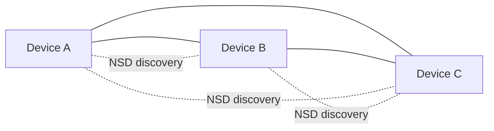
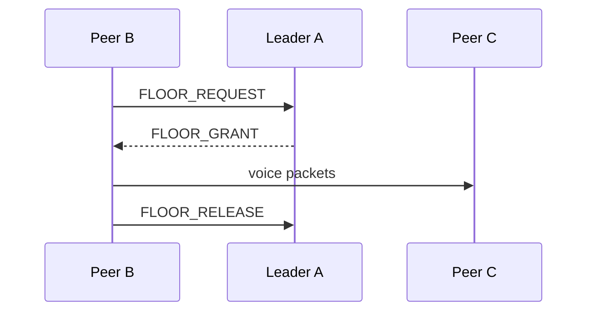

# Fast Production Roadmap (Serverless LAN-First, Android 9-15)

This roadmap is now aligned to the product requirement: **serverless operation on local WiFi/hotspot with auto-discovery**.

## Product Direction (Locked)

- No required external broker/server for normal operation.
- Must work when one phone enables hotspot and other phones join it.
- Auto-discovery must bring peers online with minimal manual setup.
- Keep app runnable after every implementation slice.

## Core Strategy

- Reuse proven libraries where they fit serverless LAN constraints.
- Keep fallback paths while migrating behavior.
- Ship in small vertical slices with build+smoke gate after each slice.
- Prioritize reliability over adding infrastructure complexity.

## Compatibility Target

- Android API 28 to API 35 (Android 9 to Android 15).
- Validate every phase on API 28 and API 35 devices/emulators.

## Architecture Target (Serverless)

- Discovery plane: NSD (mDNS/DNS-SD) + robustness improvements.
- Control plane: peer-to-peer app protocol over socket transport (no broker).
- Data plane: voice and chat over LAN sockets (optimized framing and buffering).
- Floor control: distributed but deterministic arbitration (single active speaker).
- Settings sync: one elected coordinator node in-cluster, no external server.

## How 3 Devices Work (Easy View)

This is the practical model for `A`, `B`, `C` on one hotspot/WiFi.

### 1) Roles

- Every device is equal at startup (`peer` mode).
- Leader election picks exactly one leader (based on current membership policy).
- Leader is the coordinator for floor control and cluster decisions.
- If leader leaves, remaining peers elect a new leader.

### 2) Channels (What Moves Where)

- Discovery channel (NSD): only for finding peers and their latest socket endpoint.
- Control channel (serverless control envelopes): heartbeat, election visibility, floor request/grant/release.
- Data channel:
  - voice packets while PTT is active
  - chat messages

### 3) Socket Topology

- Each phone has a server socket (listening).
- Outbound dialing is deterministic (`localNodeId < remoteNodeId`) to reduce duplicate links.
- Reconnect must always use the latest resolved endpoint from NSD.

### 4) Floor Control (PTT)

- Only one active speaker is allowed at a time.
- Peer sends `FLOOR_REQUEST` to leader.
- Leader replies `FLOOR_GRANT` (or busy/queued behavior).
- On release/timeout/disconnect, leader grants next queued requester.

### 5) Leader Leave/Rejoin (Expected Behavior)

When leader leaves:

1. Heartbeats from leader stop.
2. Stale timeout removes old leader from active membership.
3. Remaining devices converge to one new leader.
4. PTT/floor continues with new leader.

When old leader rejoins:

1. NSD resolve provides new endpoint (possibly new port).
2. Peers connect to latest endpoint.
3. Membership converges again.
4. Exactly one leader remains after stabilization.

### 6) Quick Mental Checklist for 3-Device Stability

- All devices see `members=3` after convergence.
- All devices agree on same `leaderNodeId`.
- Peer count in UI matches reachable connections after stabilization.
- No endless reconnect loop to an old port.
- No dual-speaker conflict during contention.

## Feature Flags

- `ff_serverless_control` (new target path)
- `ff_floor_v2`
- `ff_central_settings`
- `ff_audio_pipeline_v2`
- `ff_observability_v2`

Notes:
- Existing MQTT flags/logic are now **experimental/deprecated** and not part of the production path.

## Progress Status (Live)

- [x] Phase 0 started
- [x] Phase 1 done
- [~] Phase 2 in progress
- [~] Phase 3 in progress
- [ ] Phase 4 not started
- [ ] Phase 5 not started
- [ ] Phase 6 not started
- [ ] Phase 7 not started

## Phase Plan (Always Runnable)

## Phase 0 - Baseline and Safety Net

### Work

- Feature flag plumbing.
  - Status: [x] Done
- SLO/KPI definitions.
  - Status: [x] Done (`docs/slo.md`)
- Smoke checklist.
  - Status: [x] Done (`docs/smoke-test-checklist.md`)
- Baseline report template.
  - Status: [x] Done (`docs/reports/phase0-baseline.md`)

### Exit Criteria

- `main` builds and runs.
- Baseline report filled with real measurements.

---

## Phase 1 - Serverless Discovery and Control Stabilization

### Goal

Get robust peer discovery/control without external broker.

### Work

- Harden NSD discovery lifecycle:
  - duplicate suppression
  - stale-peer cleanup
  - reconnect strategy
- Introduce explicit control message envelope for serverless transport:
  - message type, source id, sequence, timestamp
- Keep socket fallback path during migration.
- De-prioritize broker-dependent MQTT path from production flow.

### Current Status

- [x] Control-plane status visibility added in UI.
- [x] Floor/chat workstreams started under feature-flag migration.
- [x] Serverless envelope adopted for membership heartbeat and cluster status.
- [x] Heartbeat now carries `startedAtMs + uptimeMs` to support more stable cluster behavior.
- [x] MQTT experimental path isolated from default production path.
- [x] Socket server bind strategy hardened: fixed preferred port with bounded fallback range.
- [x] Leader liveness/election updated to local receive-time semantics to avoid cross-device clock skew stalls.
- [x] Rejoin handling hardened with session-aware membership (`nodeId + startedAtMs`).
- [x] Deterministic single-dial policy added (`localNodeId < remoteNodeId` initiates outbound) to reduce dual-link churn.
- [x] Connection state flapping reduced with short disconnect debounce on transport drops.

### Exit Criteria

- 2-5 devices auto-discover reliably on hotspot/WiFi.
- No manual broker/server config required.
- PTT/chat/floor operate end-to-end serverless.

---

## Phase 2 - Deterministic Floor Arbitration (Serverless)

### Goal

Ensure only one active speaker at a time under contention.

### Work

- Deterministic floor arbitration policy:
  - lease owner
  - lease timeout
  - release/renew
- Conflict resolution when simultaneous press occurs.
- Recovery on disconnect while holding floor.

### Current Status

- [x] Leader-authoritative `FLOOR_REQUEST/GRANT/RELEASE` control messages added.
- [x] PTT now waits for grant before transmit in serverless mode.
- [x] Queueing implemented (busy response + FIFO grant).
- [x] Request-timeout fallback implemented.
- [x] Lease cleanup hardening added on release/disconnect paths.
- [x] UI-side remote-speaker state made robust with watchdog timeout + forced cleanup on floor release.

### Exit Criteria

- No reproducible dual-speaker conflict in contention tests.
- Floor recovers cleanly after owner disconnect.

---

## Phase 3 - Centralized Settings (In-Cluster Coordinator)

### Goal

Cluster-wide settings sync without external backend.

### Work

- Coordinator election policy within LAN cluster.
- Versioned settings snapshot distribution.
- Join-time sync for new peers.
- Safe fallback to last good local config.

### Current Status

- [x] Coordinator/leader election is active in cluster membership state.
- [x] Leader preference updated to oldest member in cluster session.
- [x] Settings section now enforces leader-only controls for operational settings, with peer-safe options still available.
- [~] Full versioned snapshot sync/distribution still pending.

### Exit Criteria

- New peer receives active settings automatically.
- Settings consistency verified across peers.

---

## Phase 4 - Audio Pipeline Quality and Scale (Serverless)

### Goal

Improve voice quality and scalability without central media server.

### Work

- Better framing and jitter handling.
- Packet ordering/drop handling.
- Bandwidth/CPU tuning for hotspot scenarios.
- Optional codec optimization path.

### Exit Criteria

- Better latency/continuity vs baseline.
- Stable group call behavior at target room size.

---

## Phase 5 - Reliability and Diagnostics

### Goal

Operational visibility and predictable recovery.

### Work

- Diagnostics panel:
  - discovery state
  - peer count
  - floor owner
  - transport health
- Incident-friendly logging and export bundle.
- Reconnect/backoff hardening.

### Exit Criteria

- Field failures are diagnosable from logs/status UI.
- Recovery after WiFi churn is stable.

---

## Phase 6 - Security and Rollout

### Goal

Secure serverless LAN operation and staged release.

### Work

- Device trust model and join policy.
- Replay/spoof mitigation for control messages.
- Pilot rollout and KPI gates.

### Exit Criteria

- Unauthorized peer cannot take floor/control.
- Pilot passes SLO thresholds.

---

## Phase 7 - Embedded Local Data Store (Next)

### Goal

Persist core app data locally for better UX, diagnostics, and recovery.

### Work

- Add an embedded local database (Room preferred) for:
  - call/session logs
  - local username/profile metadata
  - chat history
- Define retention policy and lightweight cleanup job.
- Expose repository APIs to PTT/chat/settings modules.
- Add migration-safe schema versioning from day one.

### Exit Criteria

- Chat history survives app restart.
- Username/profile persists across app restarts.
- Call logs can be viewed/exported for diagnostics.

## What Is Out of Scope (for this plan)

- Mandatory broker/server dependencies for basic operation.
- Cloud-first architecture for same-LAN use cases.

## Execution Rules Per PR

- One vertical slice per PR.
- Keep app runnable at all times.
- `./gradlew assembleDebug` must pass.
- Run 2-device hotspot smoke test for every control-plane/floor change.

## Immediate Next Step

1. Implement Phase 7 foundation: Room schema + DAO + repositories for call logs, username, and chat history.
2. Integrate chat feature with persisted message history (load on startup).
3. Add basic logs/history UI read path and retention cleanup.
